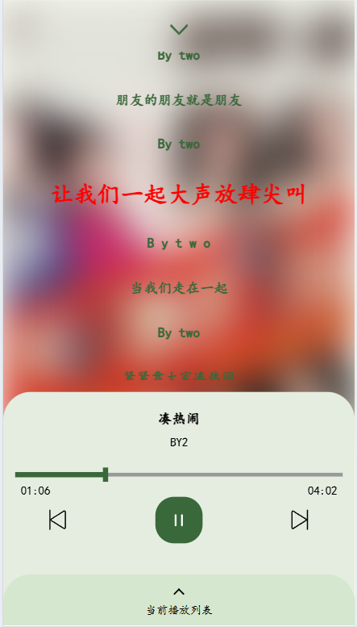
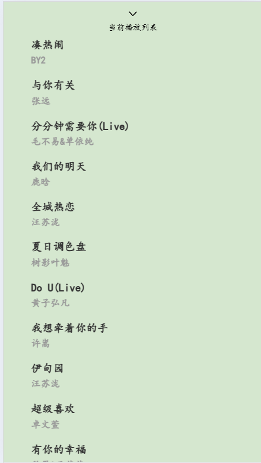

# 笒鬼鬼音乐
## 是一个基于vue3.0的移动端音乐播放器
### 使用请留个版权可好，制作不易
### 一个学校的学习项目，写得不好，大牛勿喷，还有更多功能没有写

# 演示

##### 首页


##### 歌单详情


##### 搜索


##### 歌词


##### 播放列表



# 项目说明

## 项目运行

```
npm install
```

```
npm run serve
```

## 项目打包

```
npm run build
```

## 同时也需要安装vant

```
npm install vant --save
```
    
## axios

```
npm install axios --save
```
    
## 由于压缩的是整体包下即可运行

```
npm run serve
```


### 赞赏

##### 微信 & 支付宝
<table>
  <tr>
    <td></td>
    <td></td>
  </tr>
</table>

